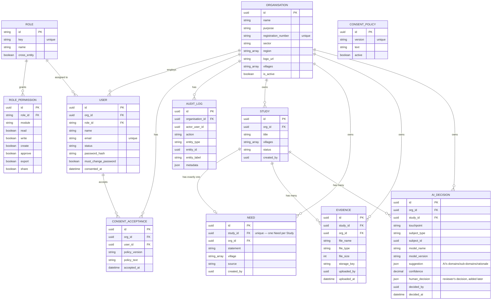

# RIO Backend — Plain-English Guide

One file, no jargon required. If you can read a spreadsheet, you can follow this.

Stack: NestJS (the web server framework) + Prisma (talks to the database) + PostgreSQL (the database).

---

## 1. The big picture

Every NGO ("Organisation") that signs up gets its own private slice of data. A researcher
at one NGO can never see another NGO's studies, users, or files — this is enforced by the
**database itself** (Row-Level Security / RLS), not just by application code. Even if a bug
in our code forgot to filter by organisation, Postgres would still refuse to return rows
that don't belong to the caller's org. This is explained in detail in [Section 5](#5-multi-tenancy--how-data-stays-private-per-ngo).

The main workflow the backend supports (added in "Week 2") is:

```
Create Study → Capture Need → Upload Evidence → Submit Evidence → AI Classification → Human Review
```

Each arrow is a real API call, and each one moves a `Study` row's `status` field forward.
Nothing skips a step — you can't classify a study that has no Need, and you can't submit
evidence before it's uploaded.

---

## 2. Every database table, in plain terms

| Table | What it stores | Created |
|---|---|---|
| `roles` / `role_permissions` | The fixed list of roles (NGO Admin, Researcher, Reviewer, Supervisor, etc.) and what each role can read/write/approve per module. Seeded once, never edited by users. | original schema |
| `consent_policies` | The versioned text of the privacy/consent agreement users must accept. | original schema |
| `organisations` | One row per NGO. Name, purpose, registration number, sector, region(s), logo, villages list. `region` is a list of strings (an NGO can span more than one region), not a single comma-separated string. | original schema, later widened (see §3) |
| `users` | One row per person. Belongs to exactly one organisation and one role. | original schema |
| `consent_acceptances` | A permanent record of "this user accepted this exact policy text at this exact time." | original schema |
| `audit_logs` | Every create/edit/delete anyone does, anywhere in the app, with before/after values. Append-only — nothing is ever updated or deleted from this table. | original schema |
| **`studies`** | One row per Study. Title, status, which villages it covers, who created it. | Week 2 |
| **`needs`** | The single "statement of need" for a Study — what problem is being documented, which village(s), and the source of that information. `village` is a list of strings (a Need can name more than one village), not a single comma-separated string. | Week 2 |
| **`evidence`** | One row per uploaded supporting file (PDF/CSV/XLS/XLSX/DOC/DOCX/JPG/JPEG/PNG) attached to a Study. | Week 2 |
| **`ai_decisions`** | One row per AI Classification run, holding both the AI's suggestion and (once reviewed) the human reviewer's decision — on the *same* row, so the audit trail never loses the AI's original suggestion even after a human overrides it. | Week 2 |
| **`domains`** / **`sub_domains`** | The fixed hierarchy of "problem categories" (e.g. WASH → Water Access) that a Need gets classified into. Global reference data — same NGO-wide, no `org_id`. | Week 2/3 (§9) |
| **`methodology_configs`** | One single row holding the org-wide priority-scoring rulebook: severity thresholds, the 9 factor weights, confidence-flag settings, and version/publish tracking. | Week 2/3 (§9) |
| **`public_survey_links`** | One row per QR-code link generated for a Study — a token, expiry, active/inactive. | Week 2/3 (§10) |
| **`citizen_otp_challenges`** | One row per "send me a code" request from a citizen filling out a public survey — the code (hashed), attempts, expiry, and whether it's been verified/consumed. | Week 2/3 (§10) |
| **`survey_responses`** | One row per citizen's completed survey submission. | Week 2/3 (§10) |
| **`response_quality_results`** | One row per survey response, holding a completeness score, a confidence flag, and whether it looks like a duplicate. | Week 2/3 (§11) |
| **`ai_summaries`** | One row per "summarize this Study's responses" run. | Week 2/3 (§11) |
| **`priority_scores`** | One row per "how urgent is this Study" scoring run — overall score, level (critical/high/medium/low), and the per-factor breakdown. | Week 2/3 (§12) |
| **`sharing_requests`** | One row per "can I see your Study" request between two NGOs — pending/approved/rejected, plus who decided it and when. | Week 2/3 (§13) |
| **`reports`** | One row per generated report (any of the 13 report types) — its content (as JSON), status (draft/approved/rejected), and who reviewed it. | Week 2/3 (§14) |

### Schema diagram

Boxes are tables, lines are relationships. `PK` = the row's own id, `FK` = a column that
points to another table's `PK`. Tables added in Week 2 are `studies`, `needs`, `evidence`,
`ai_decisions` (the bottom cluster) — everything else already existed.



### Rules baked into the tables themselves (not just app code)

- **One Need per Study** — the database has a *unique* constraint on `needs.study_id`. It is
  physically impossible to insert a second Need for the same Study, even if application code
  had a bug that tried.
- **One AI Classification can hold many suggested domains** — `ai_decisions.suggestion` stores
  a list (`domains: string[]`, `subDomains: string[]`), so the AI can suggest multiple
  categories for one Need. This is different from "multiple Needs," which is not allowed.
- Every tenant-owned table (`studies`, `needs`, `evidence`, `ai_decisions`, `users`,
  `consent_acceptances`) carries an `org_id` column that Postgres RLS checks on every single
  query — see §5.
- **Villages and regions are real lists, not comma-separated strings** — `needs.village` and
  `organisations.region` are Postgres `TEXT[]` columns. Typing "Al Wathba, Al Falah, Bani Yas"
  into the Village field produces three separate array elements, not one literal string that
  happens to contain commas. (This used to be a single `VARCHAR` column for both — a real bug,
  fixed in the migration described in §3, which also split any already-existing
  comma-separated values into proper array elements.)

---

## 3. What actually changed in this pass (one migration)

Database changes are called "migrations" — small, ordered SQL scripts that update the table
structure. Everything for Week 2 (Study/Need/Evidence/AI Classification) lives 1in a single
migration, **`20260714120000_week2_data_capture`**:

- Creates the four new tables (`studies`, `needs`, `evidence`, `ai_decisions`) from scratch,
  in their final shape — `needs.village`/`studies.villages` as real lists (`TEXT[]`),
  `evidence.file_size` already present, and the `StudyStatus` enum already using
  `evidence_submitted` (not an intermediate `evidence_uploaded` value that gets renamed
  later) — plus their RLS policies and permissions.
  - This was originally written and applied as 4 separate migrations over a few days; since
    none of them had been committed to git yet, they were squashed into this one file in its
    final form rather than keeping the (never-shared) intermediate steps around forever.
- Widens `organisations.region` from a single `VARCHAR` to a real list (`TEXT[]`) — that
  column predates this migration (added, nullable, by the original `init_domain` migration),
  so this part is a genuine `ALTER COLUMN`, not something folded into a fresh `CREATE TABLE`.
  Any pre-existing comma-separated value is split into proper array elements automatically.

Organisation profile fields (`purpose`, `registration_number`) and auth/signup fields were
widened in an earlier, separate migration in the same Week 2 effort — see §7.

No tables were dropped. No existing data was destroyed by this migration.

*(A second, much larger batch of new tables — Domains, Methodology Configuration, Publish
Survey/Citizen flow, Response Quality, Priority, Sharing, Reports — was added in the
Week 2/3 Dev1 pass described starting at §9. That batch's own migration squash is covered
in §15, following the same "combine same-pass features into one migration" convention as
this section.)*

---

## 4. Creating a Study, step by step — what the backend actually does

This is the exact sequence a Researcher goes through, and what happens server-side at each step.

### Step 1 — `POST /studies` (Create Study)
Body: just `{ title }` (villages can optionally be sent too, but the frontend currently only
sends the title). Creates a `studies` row with `status = 'draft'`.

### Step 2 — `POST /studies/:id/need` (Capture Need)
Body: `{ statement, village, source }` — `village` is a list of strings (at least one
required), not a single string. Because of the database's unique constraint, this fails with
a clear error if a Need already exists for this Study. On success, the Study's status
automatically moves to `need_captured`.

### Step 3 — `POST /studies/:id/evidence` (Upload Evidence)
Accepts one or more files. Before saving anything, the server checks:
- **File type** — only `.pdf .csv .xls .xlsx .doc .docx .jpg .jpeg .png`. Anything else is
  rejected.
- **File size** — max 10MB per file.
- **File count** — max 10 files per Study, total (not per upload — if you already have 8
  files, you can only add 2 more).

Uploading **does not** change the Study's status by itself (this was a deliberate business
decision — see the note in the code). Files are saved to local disk
for now (`storageKey` is just a filename); swapping to cloud storage later needs no schema
change.

### Step 4 — `POST /studies/:id/evidence/submit` (Submit Evidence)
This is a separate, explicit action a Researcher takes once they're done uploading. It
checks that a Need exists and at least one file has been uploaded, then moves the Study's
status to `evidence_submitted`. Calling it again later (e.g. after adding more files) is
harmless — it just does nothing if the status has already moved past this point.

**Why upload and submit are two separate steps:** so that a Researcher can upload files
across multiple sessions without accidentally triggering AI Classification (which is gated
on submission, not on upload) before they're actually ready.

### Step 5 — `POST /studies/:id/classify` (AI Classification)
Only allowed once the Study is at `evidence_submitted` or further — trying to classify a
Study still at `draft`/`need_captured` returns a clear `409 EVIDENCE_NOT_SUBMITTED` error.

What happens: the Need's statement is stripped of anything that looks like an email address
or phone number (basic PII redaction, done in code — see §6), then handed to the classifier.
A row is written to `ai_decisions` holding the suggestion, and the Study's status moves to
`ai_classified`.

### Step 6 — `PATCH /ai-decisions/:id/review` (Human Review)
A reviewer either **approves** the AI's suggestion as-is, or **overrides** it (supplying
their own domains/sub-domains and a mandatory reason). Either way this is written onto the
*same* `ai_decisions` row (not a new row) as `humanDecision`, and the Study's status moves to
its final stage, `human_reviewed`.

### Deleting a Study
A Study can only be deleted while it's still `draft`, `need_captured`, or
`evidence_submitted`. Once it's been `ai_classified` or `human_reviewed`, deletion is blocked
(`409 STUDY_NOT_DELETABLE`) — the reasoning being that once AI/human decisions reference it,
other people may be relying on that record.

---

## 5. Multi-tenancy — how data stays private per NGO

Two safety nets, not one:

1. **Application code** always scopes queries to "the current caller's organisation" via a
   helper called `requireOrgId()`.
2. **The database itself** enforces the same rule independently, via Postgres Row-Level
   Security. Every tenant table has a policy that says, roughly: *"you may only see/change
   rows where `org_id` matches the organisation currently set for this connection."* This
   is turned on with `FORCE ROW LEVEL SECURITY`, meaning it applies even to the app's own
   database user — there is no backdoor.

So even a coding mistake that forgot to filter by organisation would still come back empty —
Postgres itself is the last line of defense, not just a nice-to-have.

There's also a special **read-only cross-org role** (`cnap_supervisor`) used only by roles
like "Center Supervisor" that are explicitly meant to see across every NGO — it can `SELECT`
from any organisation's rows, but cannot write anything, ever.

---

## 6. AI Classification & Scoring — what's real vs. placeholder

**Be direct about this with stakeholders:** none of the "AI" in this phase is a trained
model. It's a placeholder that always returns the same thing, and it exists so that the
rest of the workflow (Human Review, statuses, the UI) has something real to plug into once
an actual model is ready.

- **Classification placeholder** (`classification.placeholder.ts`) — always returns
  `domains: ["Uncategorized"]`, `subDomains: ["Uncategorized"]`, confidence `0`, and a
  rationale string that literally says *"Placeholder classification pending business rules
  and LLM integration."* The one real piece of logic it does perform: stripping anything
  that looks like an email or phone number out of the Need's statement before it would be
  sent to a model.
- **Scoring placeholder** (`scoring.placeholder.ts`) — even simpler: there's no "Survey
  Response" data yet to score against, so this doesn't write anything to the database at
  all. It just returns `{ status: "pending", message: "Scoring engine will be implemented
  after business rules are finalized." }`.

When the real model/scoring rules are ready, only these two files need to change — the
database shape (`ai_decisions.suggestion` as a flexible JSON column) was deliberately built
to not need a schema change for that swap.

---

## 7. Everything else touched this pass (briefly)

- **Organisations** — added `purpose` (free text, used when an NGO's sector is "Other") and
  `registration_number` (unique — this is what prevents the same NGO signing up twice and
  creating a duplicate admin account).
- **Auth / Signup** — public NGO self-signup now accepts `sector` and `purpose`; a temporary
  password is generated, emailed if possible, and the user must change it on first login.
- **Audit log** — every module above (Studies, Needs, Evidence, AI Decisions, Organisations)
  writes to `audit_logs` on every create/edit/delete, including a before/after diff of which
  fields changed. This is what powers the Audit Log screen in the UI.
- **Consent** — unrelated to Studies; tracks acceptance of the platform's privacy policy per
  user, versioned so we always know exactly which wording someone agreed to.
- **Village/region arrays** — fixed a real bug where typing several villages/regions
  separated by commas was stored as one literal string instead of being treated as separate
  values (see §2's "Rules baked into the tables" and §3).
- **Evidence file types** — JPG/JPEG/PNG were added to the accepted evidence file types,
  alongside PDF/CSV/XLS/XLSX/DOC/DOCX (see `evidence.storage.service.ts`).

---

## 8. Where to look in the code, if you need to go deeper

| Question | File |
|---|---|
| What columns exist on every table? | `prisma/schema.prisma` |
| What actually changed in the database, in order? | `prisma/migrations/*/migration.sql` (read folder names in order — they're timestamped) |
| What happens when a Study is created/edited/deleted? | `src/modules/studies/studies.service.ts` |
| What happens when a Need is captured? | `src/modules/needs/needs.service.ts`, `needs.contract.ts` (village-as-list validation) |
| Evidence upload rules (file type/size/count) | `src/modules/evidence/evidence.storage.service.ts` |
| Evidence upload → submit → status flow | `src/modules/evidence/evidence.service.ts` |
| AI Classification + Human Review logic | `src/modules/ai-decisions/ai-decisions.service.ts` |
| The (fake, for now) AI logic itself | `src/modules/ai-decisions/classification.placeholder.ts`, `scoring.placeholder.ts` |
| How org-isolation actually works | `src/tenancy/org-context.ts`, `src/tenancy/tenant-prisma.service.ts` |
| Signup / login | `src/modules/auth/auth.service.ts` |
| Domain/Sub-Domain Master, Methodology Configuration | `src/modules/domains/`, `src/modules/methodology-config/` |
| Publish Survey + Citizen public flow | `src/modules/public-surveys/`, `src/modules/citizen/`, `src/modules/survey-definition/` |
| Response Quality, AI Summary | `src/modules/response-quality/` |
| Priority Dashboard/Scoring | `src/modules/priority/` |
| Sharing (cross-org requests) | `src/modules/sharing/` |
| Reports (RPT-01..13), real PDF/Excel export | `src/modules/reports/` |
| Reviewer SLA, Archive, Program Supervisor Dashboard | `src/modules/reviewer-sla/`, `src/modules/archive/`, `src/modules/supervisor-overview/` |

---

## 9. Consent — moved from signup-time to post-first-login

Signup used to stamp a user's consent immediately, as part of creating the account — which
meant nobody ever actually *saw* the consent screen, they were just marked as having agreed.
That's now fixed: signup no longer touches `consented_at` or writes a `consent_acceptances`
row at all (see `AuthRepository.createOrganisationAndAdmin`). Instead:

1. A brand-new user (after a signup-issued temporary password is replaced, if applicable)
   hits a real consent screen on their first login.
2. `POST /auth/consent` looks up the currently-`active` `consent_policies` row, stamps
   `users.consented_at` + a new column **`users.consented_policy_version`**, and writes an
   immutable `consent_acceptances` snapshot row (policy version + policy text + timestamp) —
   all three in one transaction.
3. Every login/`/auth/me` call returns `consentedPolicyVersion` alongside the live active
   policy's version, so the frontend can show the consent screen again *only* when those two
   values differ — i.e. only when an admin publishes a brand-new policy version. A normal
   day-to-day login never re-shows it.

This is why `consented_policy_version` exists as its own column instead of the frontend just
checking "is `consented_at` set" — a plain truthiness check could never detect "the policy
changed since you last agreed," only "have you ever agreed to anything, ever."

---

## 10. Domain/Sub-Domain Master + Methodology Configuration

Two related global reference modules — global meaning NGO-wide, not per-organisation, same
family as `roles`/`consent_policies` (no `org_id`, no RLS).

**Domains/Sub-Domains** (`domains`, `sub_domains`) are the fixed problem-category hierarchy
(e.g. "WASH" → "Water Access") that a Need eventually gets classified into. Deactivating a
Domain (there's no delete — see the pattern in §2) **cascades to deactivate its Sub-Domains
too**, one-way: reactivating the Domain does *not* bring its Sub-Domains back automatically,
a reviewer has to explicitly reactivate each one. This stops "an active Sub-Domain under an
invisible Domain" from ever existing.

**Methodology Configuration** (`methodology_configs`) is a single-row table holding the whole
priority-scoring rulebook in one place, instead of scattered hardcoded constants in code:

- `priority_thresholds` — the score cutoffs for Critical/High/Medium/equity-flagged-High.
  Seeded at `{criticalSeverity: 80, highSeverity: 70, mediumSeverity: 40, equityHighSeverity: 50}`.
  The server rejects a save that doesn't satisfy `critical > high > medium` and
  `equityHighSeverity <= highSeverity` — this is enforced in `MethodologyConfigService`, not
  just the UI, so it holds regardless of what calls the API.
- `priority_factor_weights` — the 9 factors from the methodology workbook (Severity 20%,
  Affected Population 15%, Service Availability Gap 12%, Urgency 12%, Data Confidence 10%,
  Frequency 10%, Geographic Coverage 8%, Vulnerable Groups 8%, Strategic Alignment 5%),
  previously hardcoded inside `priority.placeholder.ts` and now editable here instead.
- `confidence_flag_settings` — the "Don't know" ratio threshold and minimum-respondent count
  that decide whether a Study's data quality reads as `standard` or `low` confidence.
- `version`/`status`(`draft`/`published`)/`published_by`/`published_at` — lets an admin edit
  freely as a draft and then explicitly publish, with a record of who published which version
  and when.

---

## 11. Publish Survey + Citizen Public Flow (QR code → OTP → submit)

This is the only part of the backend where the caller isn't logged in at all — a citizen
scans a QR code, types their phone/email, verifies a one-time code, and submits answers,
with no account and no session cookie anywhere.

**How an anonymous caller still gets safe, tenant-scoped writes:** every route resolves the
owning organisation from the link's token first (via the same read-only `cnap_supervisor`
cross-org connection used elsewhere), then every actual write goes through
`TenantPrismaService.runAsOrg(resolvedOrgId, ...)` — same Row-Level-Security safety net as a
logged-in NGO user, just with the org picked out from the token instead of a session.

Flow, table by table:

1. **`GET /public/surveys/:token`** — resolves the link (`public_survey_links`), checks it's
   still `is_active` and not expired, and returns the Study's questions. The question set
   itself still comes from a placeholder (`survey-definition.placeholder.ts`) — **every Study
   currently gets the exact same fixed 4-question survey** — pending the real Survey Builder.
   This same call also now returns the real Study title and organisation name (previously
   only the placeholder survey's generic title), so the citizen flow can show real context
   before the first question.
2. **`POST /public/surveys/:token/otp/request`** — creates a `citizen_otp_challenges` row
   (code hashed, 10-minute expiry) and emails it via the real `MailerService`. In
   non-production, the code is also printed to the server console so local testing isn't
   blocked on an inbox.
3. **`POST /public/surveys/:token/otp/verify`** — checks the code against the hash, max 5
   attempts before the challenge is dead and a new one has to be requested.
4. **`POST /public/surveys/:token/responses`** — writes a `survey_responses` row. Blocked two
   ways as of today (previously **not** blocked at all):
   - **`OTP_ALREADY_USED`** — a challenge that's already produced one response can't produce
     a second one, even with the same still-known `challengeId`.
   - **`DUPLICATE_SUBMISSION`** — even a *brand-new* OTP request/verification for the same
     contact is blocked if that contact already has a response for the Study. Both checks
     plus the write happen inside one transaction (`consumed_at` is stamped on the challenge
     at the same time the response is created).

---

## 12. Response Quality + AI Summary

Both read from `survey_responses` for a given Study and are triggered manually (a reviewer
clicks a button), not automatically:

- **Response Quality** (`response_quality_results`) — a completeness score (how many answers
  were actually filled in), a `standard`/`low` confidence flag (driven by the Methodology
  Configuration settings from §10), and duplicate detection. The duplicate check here is an
  **exact match** on `(contact, serialized answers)` within the same assessment batch — a
  real fuzzy/near-duplicate detector is a documented future replacement for just this one
  function, not a rewrite of the whole feature.
- **AI Summary** (`ai_summaries`) — a canned narrative template ("Placeholder AI summary: N
  response(s) received...") pending real LLM integration. Same "swap one function later, no
  schema change" pattern as AI Classification in §6.

---

## 13. Priority Dashboard / Scoring

`priority_scores` holds one row per "how urgent is this Study" scoring run — an overall
score, a level (`critical`/`high`/`medium`/`low`), a gap type, and a per-factor breakdown
using the weights from Methodology Configuration (§10). The scoring formula itself
(`priority.placeholder.ts`) is still a placeholder pending the real methodology workbook —
every score the API returns is explicitly marked `isPlaceholder: true` so nothing downstream
can mistake it for the final methodology.

The org-wide dashboard list (`GET /priority-scores`) returns **every Study in the
organisation**, whether or not it's ever been scored — a Study with no score just comes back
with `score: null`. This used to only return Studies that already had a score row, which
silently hid any Study nobody had gotten around to scoring yet.

---

## 14. Sharing (cross-org "can I see your Study" requests)

`sharing_requests` deliberately has **no Row-Level Security** — unlike almost every other
tenant table, a sharing request is inherently visible to *two* different organisations (the
owner and the requester) plus the cross-entity Center Supervisor, so authorization is
enforced in the service layer instead of the database.

Flow: a requesting org picks another org and one of that org's **completed
(`human_reviewed`) Studies only** (via two lookup endpoints,
`GET /sharing-requests/lookup/organizations` and
`.../lookup/organizations/:orgId/studies`, both added this pass so the frontend never has to
ask someone to type in a raw organisation/Study ID) → the request sits `pending` → the owning
org approves or rejects it. On approve, the requester gets a real read-only view of the Study
via `GET /sharing-requests/:id/shared-study`; on reject, that view stays forbidden forever
(re-requesting is possible, but a rejected request itself doesn't reopen).

*A real RLS bug was caught and fixed here during this pass*: the two lookup endpoints first
read `organisations` via the plain tenant-scoped Prisma client, which silently returned
nothing for every organisation except the caller's own (organisations **does** have RLS,
unlike the global reference tables in §10) — fixed by routing those reads through the
cross-org `cnap_supervisor` connection instead, same pattern citizen/priority-dashboard
lookups already use.

---

## 15. Reports (RPT-01 through RPT-13)

One flexible `reports` table backs all 13 report types from the product spec — `report_type`
is an enum (`RPT01`..`RPT13`), `content` is a JSON column shaped differently per type (an
Individual Study Report's content looks nothing like a Village-wise Needs report's), and
`filters` records exactly what filters were active when it was generated.

Lifecycle: **Generate → Draft → Approve/Reject → Export** (export only allowed once
approved). 11 of the 13 report types pull real data (Study/Need/Evidence/AiDecision/
PriorityScore/SharingRequest, depending on type); two are explicit, documented gaps rather
than fake numbers — Gender-wise Needs (`RPT07`) returns `{available: false}` because gender
isn't collected anywhere yet, and KPI Results (`RPT08`) returns `{available: false}` pending
Question Bank/Indicator integration.

**Export used to be fake** — `buildExportStub()` returned plain UTF-8 text wearing a
`.pdf`/`.xlsx` file extension, which no real PDF/Excel reader could open. Fixed this pass:
- A small, dependency-free, hand-written PDF generator (`pdf-builder.ts`) that produces a
  genuinely valid single-page PDF (title + the report's own content, wrapped and paginated).
- A real `.xlsx` workbook (`excel-builder.ts`, using the `exceljs` package) with an actual
  header row and real data rows — one sheet per array-shaped field in the report's content,
  plus a summary sheet for everything else.
- Both are fed by one shared generic flattener (`report-content-flatten.ts`) that turns each
  report type's differently-shaped `content` into rows/tables, so no per-report-type export
  code was needed.
- A second bug surfaced while verifying the fix: the controller was returning the export
  Buffer via `@Res({ passthrough: true })`, which made Nest JSON-serialize it
  (`{"type":"Buffer","data":[...]}`) instead of streaming raw bytes. Fixed by switching to
  `@Res()` and writing the response directly.

---

## 16. Reviewer SLA, Archive, Program Supervisor Dashboard (smaller read-oriented modules)

- **Reviewer SLA** (`reviewer-sla`) — no new table. "Pending review" is just every
  `ai_decisions` row still waiting on a human decision; due-by/at-risk/breached status is
  *computed* on every request from a configurable SLA-hours setting, not stored anywhere.
- **Archive** (`archive`) — no new table either. One filterable read view over `studies`
  (completed) and `reports` (approved) — Entity/Region/Sector/Village/Study/Report are all
  real server-side filters, not placeholders.
- **Program Supervisor Dashboard** (`supervisor-overview`) — the one screen that legitimately
  needs to see across every organisation at once (for the cross-entity Center Supervisor
  role). Deliberately its own module rather than reusing Organizations/Studies/Reports
  directly, since those stay single-org-scoped for every other role. Real cross-org joins via
  the same `cnap_supervisor` connection as everything else that needs to read across orgs —
  never a placeholder, by design, from day one.

---

## 17. A real permission-sourcing bug, fixed this pass (backend side already correct)

Worth documenting since it's easy to assume the opposite: the backend's `/auth/login` and
`/auth/me` responses have **always** included each role's full, real permission grants
(`role.permissions`, straight from `rbac/role-matrix.ts`) — the backend was never the
problem here. The frontend had a stale, unrelated local copy of the role matrix and was
reading permissions from *that* instead of from this response, which meant a real backend
permission change could silently not take effect in the UI until someone remembered to
manually re-sync the two files. That's a frontend fix, not a backend one, but it's worth
knowing the backend's response shape was correct the whole time — nothing here needed to
change to fix it.

---

## 18. What changed in the database this pass — squashed into 2 migrations

This whole pass (§9-§16) was originally written and applied as **9 separate migrations**
over the course of the day. Since none of them had been merged/shared yet, they were combined
into 2 files afterward — same "squash before merging" convention already used once for Week 2
(see §3) — rather than keeping 9 never-shared intermediate steps around forever:

- **`20260716093000_dev1_week2_week3_schema`** — every new table/column/enum from §9-§16 in
  its final shape (e.g. `methodology_configs` created once with `status`/`published_by`/
  `priority_factor_weights` already present, instead of created plain and then `ALTER`'d
  twice; `citizen_otp_challenges.consumed_at` present from creation instead of added later),
  plus each table's own RLS policies and grants.
- **`20260716093001_cnap_supervisor_grants_fix`** — one standalone grants-only fix, kept
  separate because it patches a gap in `studies`/`needs`/`evidence`/`ai_decisions` — tables
  from the *earlier*, unrelated Week 2 migration, not from this pass — so folding it into the
  schema migration above would have been a non-sequitur.

No tables were dropped, no data was lost — the local database already had every table in its
final shape from the original 9 migrations; only the migration *history bookkeeping* was
replayed (via `prisma migrate resolve --applied`, Prisma's supported way to mark a migration
as already-applied without re-running its SQL) to match the new, smaller file set.
